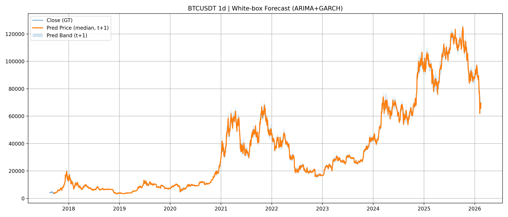
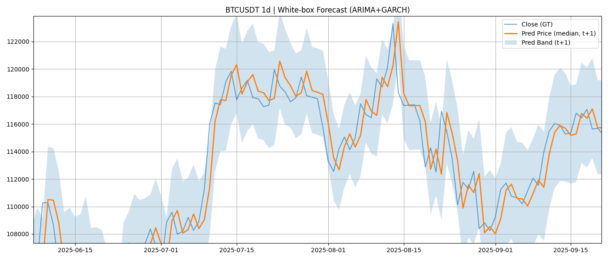
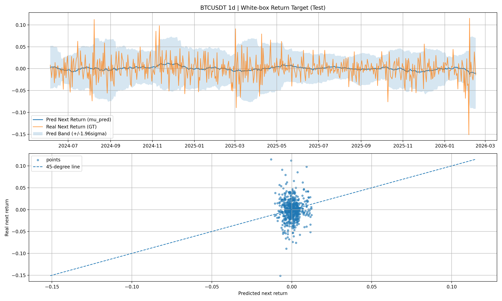
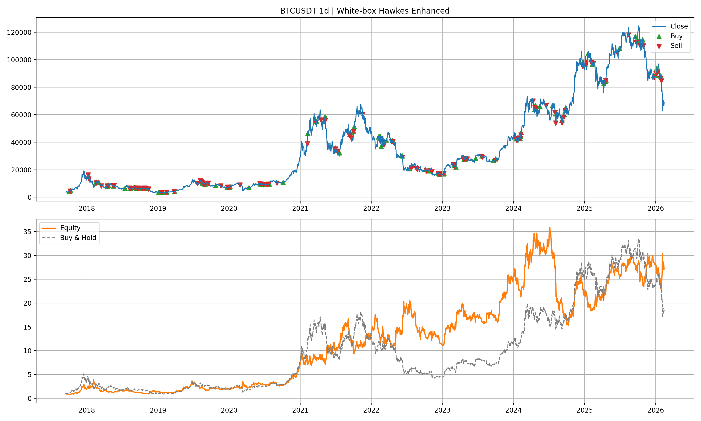

# Hawkes_Bench

Hawkes_Bench is a crypto-quant research repository for a thesis pipeline with two layers:

- Forecast layer: evaluate model forecasting quality (white-box and optional black-box input)
- Trading layer: evaluate whether Hawkes-enhanced risk scaling improves strategy robustness

## What This Repo Does

This codebase is built to compare white-box and black-box forecasts under one unified interface, then map both into the same risk-adjusted trading signal.

- White-box branch: ARIMA+GARCH
- Black-box branch: external forecast table (CSV/Parquet) from another repo
- Hawkes branch: market self-excitation intensity used as a risk scaler

## Project Layout

- `main.py`: one-click entry for `exp1 + exp2`
- `config.py`: runtime config dataclasses
- `models/whitebox/arima_garch_core.py`: ARIMA+GARCH core model
- `models/whitebox/arima_garch_adapter.py`: white-box output adapter to unified forecast frame
- `dataio/forecast_loader.py`: external black-box file loader + normalization
- `dataio/validators.py`: protocol validation (required fields, key uniqueness, quantile monotonicity)
- `hawkes/core.py`: Hawkes process implementation
- `hawkes/threshold.py`: return-event thresholding and Hawkes fitting helpers
- `hawkes/lambda_online.py`: train-time theta fit + online lambda evaluation
- `risk/native.py`: native risk inference from sigma or quantile bands
- `risk/hawkes_scaler.py`: Hawkes risk scaling
- `strategy_signal/unified_signal.py`: unified signal and position construction
- `backtest/engine.py`: strict time-aligned backtest engine
- `backtest/metrics.py`: forecast metrics + backtest metrics
- `experiments/exp1_forecast_eval.py`: Experiment 1 (forecast layer)
- `experiments/exp2_hawkes_ablation.py`: Experiment 2 (trading layer)
- `utils/visual.py`: forecast and backtest plots
- `utils/persist.py`: save metrics/tables
- `schemas/forecast_protocol.md`: external black-box data contract
- `reports/tables`, `reports/figures`: outputs

## Core Experimental Workflow

### Experiment 1: Forecast Layer

Goal: evaluate predictive quality under a reproducible split.

Steps:
1. Load and preprocess market data.
2. Produce white-box forecasts (`mu_pred`, `sigma_pred`, and prediction bands).
3. Evaluate metrics by `train/val/test` split.
4. Use `test` as primary reporting split.
5. Compute a naive baseline on `test` for sanity check.
6. Optionally evaluate black-box external forecasts on `test`.

Typical metrics:
- MSE
- MAE
- RMSE
- Pinball loss (if quantile outputs exist)

### Experiment 2: Trading Layer (Hawkes Ablation)

Goal: test whether Hawkes-enhanced risk scaling improves strategy performance.

Steps:
1. Build forecast frame.
2. Fit Hawkes theta on train split only.
3. Run online lambda across all decision times.
4. Build two strategy variants per branch:
   - Native risk
   - Hawkes-enhanced risk
5. Backtest and compare metrics.

Typical metrics:
- total_return
- cagr
- sharpe
- max_drawdown
- calmar
- hit_rate

## Environment Setup

```powershell
python -m venv env
env\Scripts\activate
pip install -r requirements.txt
```

## Data Requirements

### Market data

Default path in `main.py`:
- `market_info/BTCUSDT_1d_Binance.csv`

Required columns:
- `starttime` or `eventtime` (ms timestamp)
- `close`

### Black-box external forecast file

Template:
- `data/external_forecasts/blackbox_predictions_template.csv`

Required columns:
- `ts`, `symbol`, `horizon`, `close_t`

Optional columns:
- Point: `mu_pred`, `sigma_pred`
- Quantile: `q05,q10,q25,q50,q75,q90,q95`

If your external names differ, set `ExternalForecastConfig.column_map` in `main.py`.

## Run

Run full pipeline:

```powershell
env\Scripts\python main.py
```

By default it runs white-box only. To enable black-box input, set:
- `ExternalForecastConfig.enabled = True`
- `ExternalForecastConfig.path = <your file>`

### Auto interval policy

The pipeline auto-adapts key runtime parameters by interval (`1d`, `4h`, `1h`, `15m`, `5m`):

- `WhiteBoxConfig.rolling_window`
- `BacktestConfig.bars_per_year`
- `HawkesConfig.time_unit` (`D` or `s`)

The interval is parsed from the market filename pattern:

- `{SYMBOL}_{INTERVAL}_Binance.csv`

## Output Artifacts

### Forecast outputs

- `reports/tables/exp1_summary_metrics_{SYMBOL}_{INTERVAL}.json`
- `reports/tables/exp1_whitebox_forecast_metrics_train_{SYMBOL}_{INTERVAL}.json`
- `reports/tables/exp1_whitebox_forecast_metrics_val_{SYMBOL}_{INTERVAL}.json`
- `reports/tables/exp1_whitebox_forecast_metrics_test_{SYMBOL}_{INTERVAL}.json`
- `reports/tables/exp1_naive_forecast_metrics_test_{SYMBOL}_{INTERVAL}.json`
- optional black-box metrics on test

### Trading outputs

- `reports/tables/exp2_summary_metrics_{SYMBOL}_{INTERVAL}.json`
- per-variant backtest CSV and metric JSON files (`exp2_*`)

### Figures

- Forecast figure(s)
- Hawkes split figure
- Backtest figure(s):
  - top panel: price + buy/sell markers
  - bottom panel: strategy equity + buy-and-hold reference

## Results Showcase (How to Read the Plots)

This section highlights the key interpretation logic using the generated figures (for example, `BTCUSDT_1d` runs).

### 1) Why close-price forecast plots can look deceptively good

Relevant figure:
- `reports/figures/exp1_whitebox_forecast_{SYMBOL}_{INTERVAL}.png`

Example:




The white-box model predicts next-bar return, then reconstructs next-bar price from current observed close:
- `pred_price_next = close_t * exp(pred_return)`

Because this is rolling one-step reconstruction anchored to the latest true `close_t`, the predicted close path can visually track the real close even when return prediction quality is limited.

### 2) Use return-target plots as the primary forecast diagnostic

Relevant figure:
- `reports/figures/exp1_whitebox_return_target_test_{SYMBOL}_{INTERVAL}.png`

Example:



How to read:
- Top panel: predicted next return vs realized next return over time.
- Bottom panel: scatter of `(predicted return, realized return)` with a 45° line (`y=x`).

Interpretation:
- Points near the 45° line: accurate predictions.
- Tight vertical cloud around `x≈0` with wider `y`: model is conservative (small predicted amplitude), while real returns are more volatile.
- Large off-line points: poor capture of extreme moves.

This is why return-level plots and metrics (`MSE/MAE/RMSE`) are more informative than close-only visual overlap.

### 3) How to interpret Hawkes ablation in trading layer (exp2)

Relevant figures:
- `reports/figures/exp2_white_native_{SYMBOL}_{INTERVAL}.png`
- `reports/figures/exp2_white_hawkes_{SYMBOL}_{INTERVAL}.png`
- (if enabled) black-box counterparts: `exp2_black_native_*`, `exp2_black_hawkes_*`

Examples:




Relevant metrics:
- `reports/tables/exp2_white_native_metrics_{SYMBOL}_{INTERVAL}.json`
- `reports/tables/exp2_white_hawkes_metrics_{SYMBOL}_{INTERVAL}.json`
- `reports/tables/exp2_summary_metrics_{SYMBOL}_{INTERVAL}.json`

Reading guide:
- Compare equity curves against buy-and-hold in the same panel.
- Check whether Hawkes-enhanced version improves risk-adjusted performance:
  - Higher Sharpe/Calmar
  - Lower max drawdown
  - Similar or acceptable turnover
- If total return improves but drawdown worsens materially, treat as unstable improvement rather than robust enhancement.

## Equity Definition in Backtest Plots

`equity` is the strategy equity index, initialized at `1.0`.

- It is not raw coin price.
- It is not a position series.
- It is cumulative strategy value from per-step strategy PnL in the backtest engine.

The buy-and-hold line is a normalized price benchmark:

- `buy_and_hold = close / close[0]`

## Filename Auto-Tagging

Output filenames and figure titles are auto-tagged by parsing the market file name with:

- `{SYMBOL}_{INTERVAL}_Binance.csv`

Example:

- `BTCUSDT_1d_Binance.csv` -> `SYMBOL=BTCUSDT`, `INTERVAL=1d`

## Notes

- Current default execution mode is stateful full-notional style (`stateful_all_in`) to avoid repeated same-side orders.
- You can switch to continuous target position mode via config if needed.
